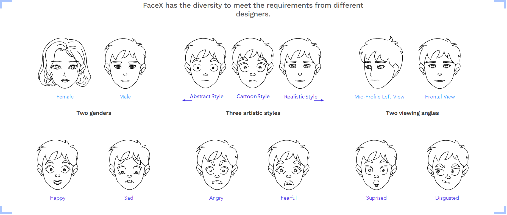
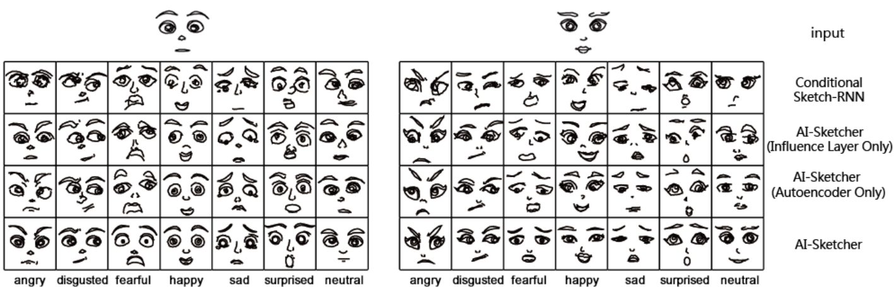

<p align="center"></p>

--------------------------------------------------------------------------------
Sketch drawings play an important role in assisting humans in communication and creative design since ancient period. This situation has motivated the development of artificial intelligence (AI) techniques for automatically generating sketches based on user input. Sketch-RNN was developed for this purpose and known as a state-of-the-art technique. However, it suffers from limitations, including the generation of lowquality results and its incapability to support multi-class generations. To address these issues, we constructed a stroke-based sketch dataset, **[FaceX](https://facex.idvxlab.com/)**. 

&nbsp;

## FaceX dataset

The dataset contains over 5 million labeled facial sketches categorized by genders (male, female), viewing angles (frontal, mid-profile left view), and emotions (neutral, happy, sad, angry, fearful, surprised, disgusted). In total, the designers drew 2,205 pairs of eyebrows, 2,016 pairs of eyes, 1,806 noses, and 2,058 mouths that satisfy aesthetic criteria. We combined these hand-drawn facial features into different faces and placed these facial features according to the divine proportion of the human head.
<p align="center"></p>
</br>
&nbsp;

## Results

FaceX dataset was used to evaluate the performance of AI-Sketcher. During the experiment, an initial face (either female or male) was used as the input, based on which seven different facial expressions were respectively generated by AI-Sketcher and three baseline models. The experiment results suggest that AI-Sketcher produced sketches with the best quality, whereas, Sketch-RNN produced the worst, i.e., the most distorted, facial sketches. The influence layer and autoencoder helped overcome the distortion.
<p align="center"></p>

## Dataset format
+ `facex_svg_181101.7z` - Scalable Vector Graphics. An XML-based vector image format for two-dimensional graphics with support for interactivity and animation. [Learn more](https://en.wikipedia.org/wiki/Scalable_Vector_Graphics)
+ `facex_npz_181101.7z` - The stroke vector format used for training the model. [Learn more](https://arxiv.org/abs/1704.03477)
&nbsp;

## Usage

#### 1. Clone the repository
```bash
$ git clone https://github.com/idvxlab/facex-dataset
$ cd facexDataset/
```

#### 2. Dataset & Libraries decompression
```bash
$ 7z x -tzip -y facex_svg_181101.7z
$ 7z x -tzip -y facex_npz_181101.7z
```

## Citation
If this work is useful for your research, please cite our paper.

* Yang Shi, Nan Cao, Xiaojuan Ma, Siji Chen and Pei Liu. 2020. [EmoG: Supporting the Sketching of Emotional Expressions for Storyboarding.](https://idvxlab.com/papers/2020CHI_EmoG_Shi.pdf) In Proceedings of the 2020 CHI Conference on Human Factors in Computing Systems. 393:1-393:12.

* Nan Cao, Xin Yan, Yang Shi, Chaoran Chen. 2019. [AI-Sketcher: A Deep Generative Model for Generating High Quality Sketches.](https://idvxlab.com/papers/2019AAAI_Sketcher_Cao.pdf) In Proceedings of the AAAI Conference on Artificial Intelligence. 2564–2571.

&nbsp;
